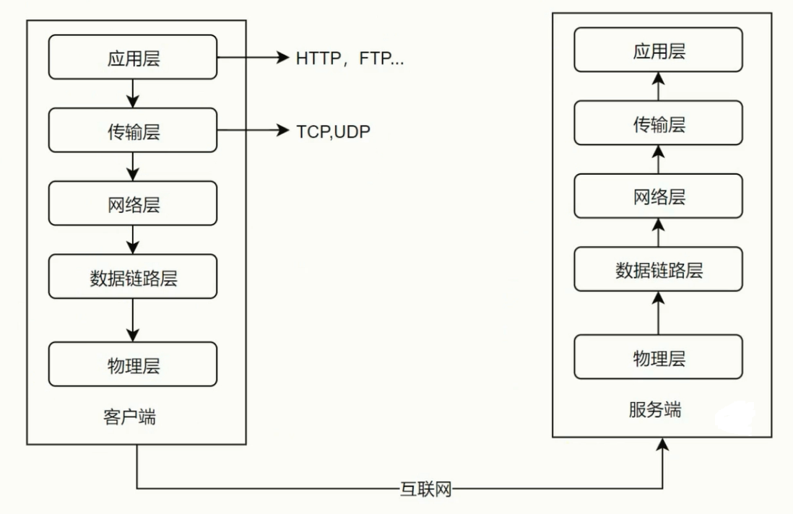

## 网络协议分层(经典五层模型)

### 低三层

- 物理层主要作用是定义物理设备如何传输数据
- 数据链路层在通信实体键简历数据链路链接
- 网络层为数据在结点之间传输创建逻辑链路

### 传输层

- 向用户提供可靠的端到端(End-to-End)服务
- 传输层向高层屏蔽了下层数据通信的细节

### 应用层

- 为应用软件提供了很多服务
- 构建于TCP协议纸上
- 屏蔽了网络传输相关细节

